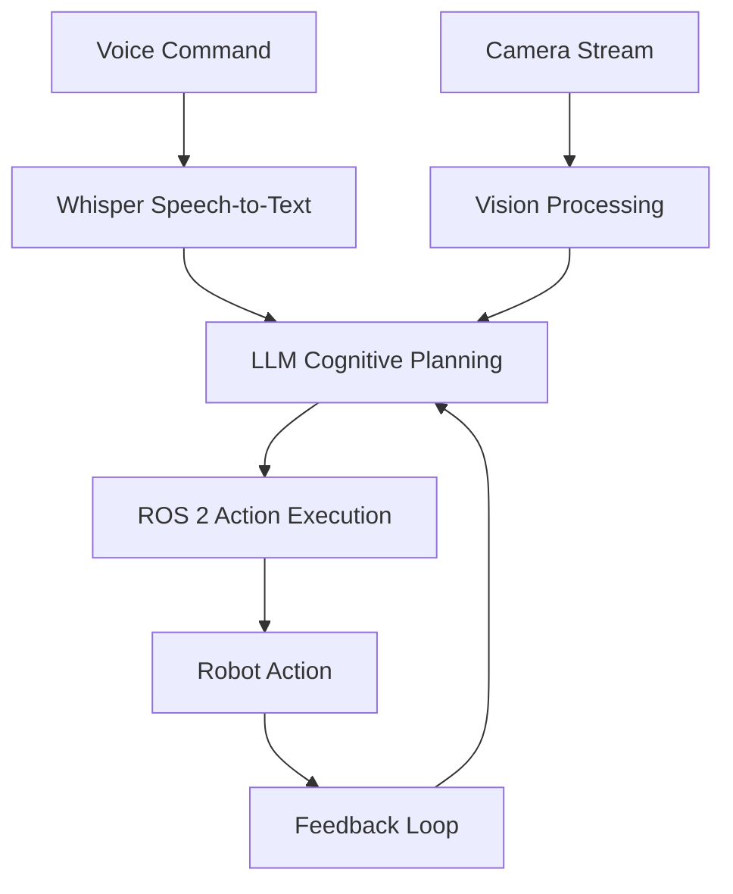

# Introduction to VLA (Vision-Language-Action)

Vision-Language-Action (VLA) systems represent the cutting edge of robotics, where robots can understand natural language commands, perceive their environment visually, and execute complex actions. This module will teach you how to build complete systems that bridge high-level natural language instructions with low-level robot control.

## What You'll Learn

In this module, you'll explore:
- How LLMs bring semantic understanding to humanoid robots
- Voice-to-text conversion using OpenAI Whisper
- LLM-based cognitive planning for task decomposition
- ROS 2 action execution pipelines
- Vision-based object understanding and manipulation
- Complete integration of navigation and manipulation

## The Complete VLA Pipeline

The VLA system consists of four interconnected components:

### 1. Speech-to-Text (Whisper)
- Converts spoken commands to text using OpenAI Whisper
- Handles streaming audio input for real-time processing
- Provides confidence scores for recognition accuracy

### 2. LLM Cognitive Planning
- Transforms high-level goals into executable sub-tasks
- Uses large language models for reasoning and decomposition
- Generates action sequences that can be executed by ROS 2

### 3. ROS 2 Action Execution
- Maps LLM output to ROS 2 actions and services
- Executes sequences with feedback loops for reliability
- Handles errors and recovery procedures

### 4. Perception (Vision)
- Integrates camera streams for object detection and localization
- Connects perception results to LLM-generated plans
- Enables intelligent manipulation based on visual input

## Prerequisites

Before starting this module, you should have:
- Basic understanding of ROS 2 concepts (covered in Module 1)
- Familiarity with Python programming
- Basic knowledge of machine learning concepts

## Learning Objectives

By the end of this module, you will be able to:
1. Explain the complete VLA pipeline from voice input to robot action
2. Implement a working voice-to-action pipeline using Whisper
3. Use LLMs for cognitive planning and task decomposition
4. Execute ROS 2 action sequences with feedback and error handling
5. Integrate vision-based perception with action planning
6. Complete a capstone project with a fully autonomous humanoid robot

## Architecture Overview

This diagram illustrates the complete VLA pipeline:
- **Voice Input**: Natural language commands from users
- **Whisper STT**: Speech-to-text conversion using OpenAI Whisper
- **LLM Planning**: Cognitive planning and task decomposition using large language models
- **ROS2 Actions**: Execution of planned actions on ROS 2-compatible robots
- **Vision**: Visual perception for object detection and scene understanding

This architecture enables robots to listen to voice commands, think about how to achieve goals, and act in the physical world with perception-awareness.

## Interactive Components

The VLA system is designed with modularity in mind, allowing each component to be developed, tested, and improved independently:

- **Speech-to-Text Module**: Can be swapped with different ASR systems
- **LLM Planning Module**: Supports various LLM architectures and prompting strategies
- **Action Execution**: Compatible with different ROS 2 distributions and robot platforms
- **Perception Module**: Works with various camera systems and detection algorithms