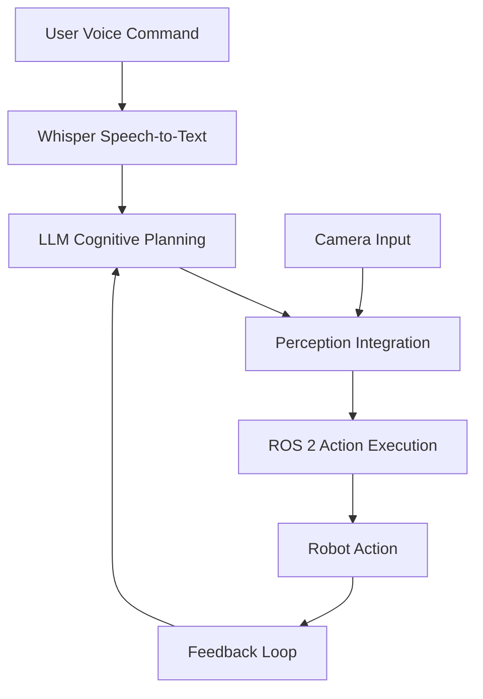

# Mini-Project: Voice-Controlled Task Runner

This mini-project brings together all the VLA components you've learned into a complete voice-controlled task execution system. You'll build a pipeline where a robot performs simple tasks from spoken commands.

## Project Overview

The voice-controlled task runner will:
1. Listen for voice commands using Whisper
2. Process commands with LLM planning
3. Execute actions using ROS 2
4. Integrate perception for intelligent execution

## Architecture



## Implementation Steps

### Step 1: Voice Command Processing

First, we'll set up the voice command processing pipeline:

```python
import asyncio
from vla_system import WhisperService, LLMPlanningService, VisionService, ROS2IntegrationService

class VoiceTaskRunner:
    def __init__(self):
        self.whisper_service = WhisperService()
        self.planning_service = LLMPlanningService()
        self.vision_service = VisionService()
        self.ros2_service = ROS2IntegrationService()

    async def process_voice_command(self, audio_data):
        """Process a voice command through the complete pipeline"""
        # Step 1: Convert speech to text
        transcription_result = await self.whisper_service.transcribe_audio(audio_data)

        if transcription_result["confidence"] < 0.5:
            return {"error": "Low confidence in transcription", "success": False}

        command_text = transcription_result["text"]
        print(f"Recognized command: {command_text}")

        # Step 2: Create plan from command
        plan = await self.planning_service.create_plan_from_goal(
            goal=command_text,
            context={"current_mode": "voice_controlled_task_runner"}
        )

        return {
            "success": True,
            "command": command_text,
            "plan": plan,
            "plan_id": plan.id
        }
```

### Step 2: Perception Integration

Next, we'll integrate perception to make the robot aware of its environment:

```python
    async def integrate_perception(self, plan, camera_image_data):
        """Integrate perception data with the execution plan"""
        # Analyze current scene
        scene_analysis = await self.vision_service.analyze_scene(camera_image_data)

        # Update plan with perception data
        perception_enhanced_plan = await self.planning_service.refine_plan(
            plan,
            feedback=f"Current scene has {scene_analysis['object_count']} objects: {', '.join(scene_analysis['object_types'])}"
        )

        return perception_enhanced_plan
```

### Step 3: Action Execution

Now we'll execute the plan using ROS 2:

```python
    async def execute_plan(self, plan):
        """Execute the planned actions using ROS 2"""
        # Map the plan to ROS 2 action sequence
        from ros2_mapping_service import ROS2MappingService
        mapping_service = ROS2MappingService()

        action_sequence = await mapping_service.map_plan_to_action_sequence(plan)

        # Validate the sequence
        is_valid, issues = await mapping_service.validate_action_sequence(action_sequence)
        if not is_valid:
            print(f"Plan validation issues: {issues}")

        # Execute the sequence
        execution_result = await self.ros2_service.execute_action_sequence(action_sequence)

        return execution_result
```

### Step 4: Complete Task Runner

Now we'll put it all together:

```python
    async def run_voice_task(self, audio_data, camera_image_data=None):
        """Run a complete voice-controlled task"""
        try:
            # Process the voice command
            voice_result = await self.process_voice_command(audio_data)

            if not voice_result["success"]:
                return voice_result

            plan = voice_result["plan"]

            # Integrate perception if camera data is available
            if camera_image_data:
                plan = await self.integrate_perception(plan, camera_image_data)

            # Execute the plan
            execution_result = await self.execute_plan(plan)

            return {
                "success": True,
                "command": voice_result["command"],
                "execution_result": execution_result,
                "summary": f"Executed {len(plan.sub_tasks)} tasks from voice command"
            }

        except Exception as e:
            return {
                "success": False,
                "error": str(e),
                "summary": "Task execution failed"
            }
```

## Complete Example Implementation

Here's a complete working example:

```python
import base64
import asyncio

class CompleteVoiceTaskRunner:
    def __init__(self):
        # Initialize all VLA services
        self.whisper_service = WhisperService()
        self.planning_service = LLMPlanningService()
        self.vision_service = VisionService()
        self.ros2_service = ROS2IntegrationService()
        self.mapping_service = ROS2MappingService()

    async def capture_and_process(self, audio_source, camera_source):
        """Capture audio and camera data and process the task"""
        # Capture audio (in practice, this would come from microphone)
        audio_data = await self._capture_audio(audio_source)

        # Capture camera image (in practice, this would come from robot camera)
        camera_image = await self._capture_camera(camera_source)

        # Run the complete task
        result = await self.run_voice_task(audio_data, camera_image)

        return result

    async def _capture_audio(self, audio_source):
        """Capture audio data (simulated)"""
        # In a real implementation, this would capture from microphone
        # For simulation, we'll return a placeholder
        return "data:audio/wav;base64,UklGRigAAABXQVZFZm10IBAAAAABAAEARKwAAIhYAQACABAAZGF0YQQAAAAAAAAAAAA="

    async def _capture_camera(self, camera_source):
        """Capture camera image (simulated)"""
        # In a real implementation, this would capture from camera
        # For simulation, we'll return a placeholder
        return "data:image/jpeg;base64,/9j/4AAQSkZJRgABAQEAYABgAAD/2wBDAAEBAQEBAQEBAQEBAQEBAQEBAQEBAQEBAQEBAQEBAQEBAQEBAQEBAQEBAQEBAQEBAQEBAQEBAQEBAQEBAQEBAQH/2wBDAQEBAQEBAQEBAQEBAQEBAQEBAQEBAQEBAQEBAQEBAQEBAQEBAQEBAQEBAQEBAQEBAQEBAQEBAQEBAQEBAQEBAQH/wAARCAABAAEDASIAAhEBAxEB/8QAFQABAQAAAAAAAAAAAAAAAAAAAAv/xAAUEAEAAAAAAAAAAAAAAAAAAAAA/8QAFQEBAQAAAAAAAAAAAAAAAAAAAAX/xAAUAQEAAAAAAAAAAAAAAAAAAAAA/9oADAMBAAIQAxAAAAH6AAAAA//Z"

    async def run_voice_task(self, audio_data, camera_image_data=None):
        """Run a complete voice-controlled task"""
        print("Starting voice-controlled task...")

        # Step 1: Speech-to-text
        print("Converting speech to text...")
        transcription_result = await self.whisper_service.transcribe_audio(audio_data)

        if transcription_result["confidence"] < 0.5:
            return {"success": False, "error": "Low confidence in transcription"}

        command_text = transcription_result["text"]
        print(f"Heard command: '{command_text}'")

        # Step 2: Scene perception (if camera available)
        scene_context = {}
        if camera_image_data:
            print("Analyzing scene...")
            scene_analysis = await self.vision_service.analyze_scene(camera_image_data)
            scene_context = {
                "current_objects": scene_analysis["object_types"],
                "object_count": scene_analysis["object_count"],
                "scene_complexity": scene_analysis["scene_complexity"]
            }
            print(f"Detected {scene_analysis['object_count']} objects: {', '.join(scene_analysis['object_types'])}")

        # Step 3: LLM Planning
        print("Generating execution plan...")
        plan = await self.planning_service.create_plan_from_goal(
            goal=command_text,
            context=scene_context
        )
        print(f"Generated plan with {len(plan.sub_tasks)} tasks")

        # Step 4: Map to ROS 2 actions
        print("Mapping to ROS 2 actions...")
        action_sequence = await self.mapping_service.map_plan_to_action_sequence(plan)
        print(f"Mapped to {len(action_sequence.actions)} ROS 2 actions")

        # Step 5: Execute
        print("Executing plan...")
        execution_result = await self.ros2_service.execute_action_sequence(action_sequence)
        print(f"Execution completed with status: {execution_result['status']}")

        return {
            "success": True,
            "command": command_text,
            "transcription_confidence": transcription_result["confidence"],
            "plan_tasks": len(plan.sub_tasks),
            "actions_executed": len(action_sequence.actions),
            "execution_status": execution_result["status"],
            "summary": f"Completed '{command_text}' with {len(plan.sub_tasks)} tasks"
        }

# Usage example
async def main():
    task_runner = CompleteVoiceTaskRunner()

    # Simulate running a task
    # In practice, audio_data would come from microphone and camera_image_data from robot camera
    result = await task_runner.run_voice_task(
        audio_data="data:audio/wav;base64,UklGRigAAABXQVZFZm10IBAAAAABAAEARKwAAIhYAQACABAAZGF0YQQAAAAAAAAAAAA=",
        camera_image_data="data:image/jpeg;base64,/9j/4AAQSkZJRgABAQEAYABgAAD/2wBDAAEBAQEBAQEBAQEBAQEBAQEBAQEBAQEBAQEBAQEBAQEBAQEBAQEBAQEBAQEBAQEBAQEBAQEBAQEBAQEBAQEBAQH/2wBDAQEBAQEBAQEBAQEBAQEBAQEBAQEBAQEBAQEBAQEBAQEBAQEBAQEBAQEBAQEBAQEBAQEBAQEBAQEBAQEBAQEBAQH/wAARCAABAAEDASIAAhEBAxEB/8QAFQABAQAAAAAAAAAAAAAAAAAAAAv/xAAUEAEAAAAAAAAAAAAAAAAAAAAA/8QAFQEBAQAAAAAAAAAAAAAAAAAAAAX/xAAUAQEAAAAAAAAAAAAAAAAAAAAA/9oADAMBAAIQAxAAAAH6AAAAA//Z"
    )

    print(f"Task result: {result}")

# Run the example
# asyncio.run(main())
```

## Testing the Task Runner

To test your voice-controlled task runner:

1. **Basic Commands**: "Go to the kitchen", "Move forward"
2. **Object Interaction**: "Pick up the red cup", "Bring me the bottle"
3. **Complex Tasks**: "Clean the table", "Set the room"

## Integration Considerations

### Error Handling
```python
async def robust_voice_task(self, audio_data, camera_image_data=None):
    """Voice task with comprehensive error handling"""
    try:
        result = await self.run_voice_task(audio_data, camera_image_data)

        if not result.get("success", False):
            print(f"Task failed: {result.get('error', 'Unknown error')}")
            return await self._handle_task_failure(result)

        return result

    except Exception as e:
        print(f"Unexpected error: {e}")
        return {"success": False, "error": str(e), "recovered": False}
```

### Feedback and Monitoring
```python
def monitor_execution(self, execution_result):
    """Monitor and provide feedback on execution"""
    success_rate = execution_result.get("success_count", 0) / execution_result.get("total_tasks", 1)

    if success_rate < 0.7:
        print("Low success rate detected - consider plan refinement")
        return "needs_attention"
    elif success_rate < 0.9:
        print("Acceptable success rate")
        return "acceptable"
    else:
        print("High success rate achieved")
        return "excellent"
```

This mini-project demonstrates the complete VLA pipeline in action, integrating voice commands, LLM planning, perception, and ROS 2 execution to create a functional voice-controlled robot task system.