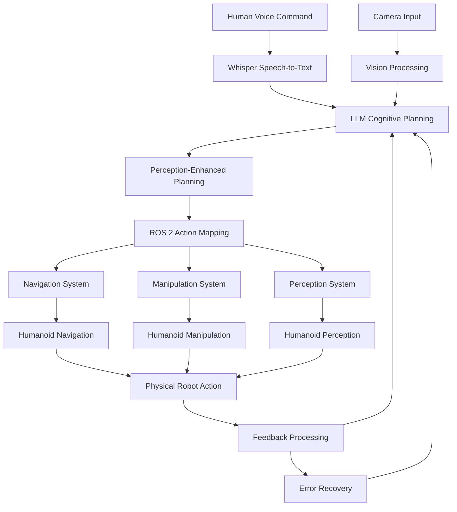

# Capstone Project: The Autonomous Humanoid

This capstone project brings together all the VLA components into a complete autonomous humanoid robot that listens to voice commands, thinks (plans), and acts. This project demonstrates mastery of the complete VLA system and provides a foundation for advanced humanoid robotics applications.

## Project Overview

The autonomous humanoid capstone will:
1. Receive complex voice commands from users
2. Process commands through the full VLA pipeline
3. Integrate perception, planning, and action execution
4. Demonstrate complex multi-step tasks
5. Handle feedback loops and error recovery

## Capstone Architecture



## Complete System Integration

### 1. Voice Command Processing

The capstone system begins with robust voice command processing:

```python
class AutonomousHumanoid:
    def __init__(self):
        # Initialize all VLA services
        self.whisper_service = WhisperService()
        self.planning_service = LLMPlanningService()
        self.vision_service = VisionService()
        self.ros2_integration = ROS2IntegrationService()
        self.mapping_service = ROS2MappingService()
        self.perception_integration = PerceptionPlanningIntegration()
        self.capstone_service = CapstoneService()

    async def process_voice_command(self, audio_data):
        """Process a voice command through the complete capstone pipeline"""
        # Validate audio quality
        validation_result = await self._validate_audio_quality(audio_data)
        if not validation_result["is_valid"]:
            return {
                "success": False,
                "error": f"Audio quality too low: {validation_result['quality_score']}",
                "recovery_suggestion": "Please speak more clearly or move closer to microphone"
            }

        # Transcribe the command
        transcription = await self.whisper_service.transcribe_audio(audio_data)

        if transcription["confidence"] < 0.6:
            return {
                "success": False,
                "error": f"Low transcription confidence: {transcription['confidence']:.2f}",
                "transcription": transcription["text"]
            }

        # Process the command through the capstone pipeline
        result = await self.capstone_service.execute_capstone_task(
            command=transcription["text"],
            audio_confidence=transcription["confidence"]
        )

        return result

    async def _validate_audio_quality(self, audio_data):
        """Validate the quality of incoming audio"""
        # In a real system, this would analyze audio features
        # like noise level, clarity, volume, etc.
        return {
            "is_valid": True,
            "quality_score": 0.9,  # Simulated quality score
            "suggestions": []
        }
```

### 2. Context-Aware Planning

The capstone system uses rich context for intelligent planning:

```python
    async def create_context_aware_plan(self, command, environment_context):
        """Create a plan that considers the full environment context"""
        # Get current scene analysis
        scene_analysis = await self.vision_service.analyze_scene_context(
            environment_context.get("current_camera_data", "")
        )

        # Get robot status
        robot_status = await self.ros2_integration.get_robot_status()

        # Create comprehensive context
        comprehensive_context = {
            "user_command": command,
            "environment_state": {
                "objects": scene_analysis["object_types"],
                "object_count": scene_analysis["object_count"],
                "spatial_distribution": scene_analysis["spatial_distribution"],
                "complexity": scene_analysis["scene_complexity"]
            },
            "robot_state": {
                "position": robot_status.get("robot_pose", {}),
                "battery_level": robot_status.get("battery_level", 1.0),
                "capabilities": robot_status.get("nodes_available", []),
                "current_tasks": robot_status.get("active_actions", 0)
            },
            "task_requirements": await self._analyze_task_requirements(command),
            "safety_constraints": await self._analyze_safety_constraints(command, scene_analysis),
            "execution_history": await self.capstone_service.get_recent_execution_history()
        }

        # Generate plan with comprehensive context
        plan = await self.planning_service.create_plan_from_goal(
            goal=command,
            context=comprehensive_context
        )

        return plan
```

### 3. Multi-Modal Execution

The capstone executes complex multi-modal tasks:

```python
    async def execute_multi_modal_task(self, plan):
        """Execute a plan that may involve multiple modalities"""
        execution_log = []
        current_state = await self._get_current_robot_state()

        for i, task in enumerate(plan.sub_tasks):
            try:
                # Update task with current state information
                updated_task = await self._update_task_with_state(task, current_state)

                # Execute the task based on its type
                if updated_task["action"] in ["navigate_to", "move_to"]:
                    result = await self._execute_navigation_task(updated_task)
                elif updated_task["action"] in ["grasp_object", "place_object", "manipulate"]:
                    result = await self._execute_manipulation_task(updated_task)
                elif updated_task["action"] in ["locate_object", "detect_objects"]:
                    result = await self._execute_perception_task(updated_task)
                elif updated_task["action"] in ["wait", "pause"]:
                    result = await self._execute_wait_task(updated_task)
                else:
                    result = await self._execute_generic_task(updated_task)

                # Update current state based on task result
                current_state = await self._update_state_from_result(current_state, result)

                # Log the execution
                execution_log.append({
                    "task_index": i,
                    "task": updated_task,
                    "result": result,
                    "timestamp": time.time()
                })

                # Check if task was critical and failed
                if not result.get("success", True) and updated_task.get("critical", False):
                    return await self._handle_critical_failure(execution_log, plan)

            except Exception as e:
                execution_log.append({
                    "task_index": i,
                    "task": task,
                    "error": str(e),
                    "timestamp": time.time()
                })
                # Continue with other tasks or handle failure based on criticality

        return {
            "success": True,
            "execution_log": execution_log,
            "final_state": current_state,
            "summary": f"Executed {len(execution_log)} tasks successfully"
        }
```

### 4. Error Recovery and Adaptation

The capstone system includes sophisticated error recovery:

```python
    async def _handle_execution_error(self, task, error, execution_log):
        """Handle errors during task execution with intelligent recovery"""
        error_type = await self._classify_error(error)

        recovery_strategies = {
            "navigation_failure": self._recover_navigation_failure,
            "manipulation_failure": self._recover_manipulation_failure,
            "perception_failure": self._recover_perception_failure,
            "communication_timeout": self._recover_communication_timeout,
            "object_not_found": self._recover_object_not_found
        }

        if error_type in recovery_strategies:
            recovery_result = await recovery_strategies[error_type](task, error, execution_log)

            if recovery_result["recovered"]:
                # Retry the task with recovery information
                return await self._retry_task_with_recovery(task, recovery_result)
            else:
                return recovery_result

        # No specific recovery strategy, return failure
        return {
            "success": False,
            "error": str(error),
            "recovered": False,
            "recovery_attempts": 0
        }

    async def _classify_error(self, error):
        """Classify an error to determine appropriate recovery strategy"""
        error_msg = str(error).lower()

        if "navigate" in error_msg or "path" in error_msg or "obstacle" in error_msg:
            return "navigation_failure"
        elif "grasp" in error_msg or "manipulat" in error_msg or "joint" in error_msg:
            return "manipulation_failure"
        elif "detect" in error_msg or "vision" in error_msg or "object" in error_msg:
            return "perception_failure"
        elif "timeout" in error_msg or "connection" in error_msg:
            return "communication_timeout"
        elif "not found" in error_msg or "missing" in error_msg:
            return "object_not_found"
        else:
            return "unknown_error"

    async def _recover_navigation_failure(self, task, error, execution_log):
        """Recover from navigation failures"""
        # Try alternative navigation approaches
        alternative_goals = await self._generate_alternative_navigation_goals(task)

        for alternative_goal in alternative_goals:
            try:
                result = await self._execute_navigation_task(alternative_goal)
                if result.get("success", False):
                    return {
                        "success": True,
                        "recovered": True,
                        "method": "alternative_path",
                        "result": result
                    }
            except:
                continue

        return {
            "success": False,
            "recovered": False,
            "method": "no_alternatives_succeeded"
        }
```

## Capstone Project Implementation

### Complete Capstone Workflow

```python
class CapstoneProject:
    def __init__(self):
        self.humanoid = AutonomousHumanoid()
        self.task_queue = asyncio.Queue()
        self.active_sessions = {}

    async def start_capstone_session(self, session_id: str, user_preferences: dict = None):
        """Start a new capstone project session"""
        session = {
            "session_id": session_id,
            "start_time": time.time(),
            "user_preferences": user_preferences or {},
            "task_history": [],
            "robot_state": await self.humanoid._get_current_robot_state(),
            "active": True
        }

        self.active_sessions[session_id] = session
        return session

    async def process_capstone_command(self, session_id: str, audio_data: str, camera_data: str = None):
        """Process a command in the context of the capstone project"""
        if session_id not in self.active_sessions:
            raise ValueError(f"Session {session_id} not found")

        session = self.active_sessions[session_id]

        # Update session with camera data if provided
        if camera_data:
            session["last_camera_data"] = camera_data

        # Process the command through the complete pipeline
        result = await self.humanoid.process_voice_command(audio_data)

        # Log the task in session history
        task_entry = {
            "command": result.get("command", "unknown"),
            "result": result,
            "timestamp": time.time(),
            "session_id": session_id
        }

        session["task_history"].append(task_entry)

        # Update robot state in session
        session["robot_state"] = await self.humanoid._get_current_robot_state()

        return result

    async def execute_complex_capstone_task(self, session_id: str, high_level_goal: str):
        """Execute a complex, multi-step capstone task"""
        if session_id not in self.active_sessions:
            raise ValueError(f"Session {session_id} not found")

        session = self.active_sessions[session_id]

        # Create a complex plan based on the high-level goal
        environment_context = {
            "current_camera_data": session.get("last_camera_data", ""),
            "user_preferences": session["user_preferences"],
            "robot_state": session["robot_state"],
            "task_history": session["task_history"]
        }

        # Generate a complex plan
        plan = await self.humanoid.create_context_aware_plan(
            high_level_goal,
            environment_context
        )

        # Execute the multi-modal task
        execution_result = await self.humanoid.execute_multi_modal_task(plan)

        # Log the complex task
        task_entry = {
            "command": high_level_goal,
            "plan": plan,
            "execution_result": execution_result,
            "timestamp": time.time(),
            "session_id": session_id
        }

        session["task_history"].append(task_entry)

        return {
            "success": True,
            "high_level_goal": high_level_goal,
            "plan_tasks": len(plan.sub_tasks),
            "execution_result": execution_result,
            "summary": f"Completed complex task: {high_level_goal}"
        }

    async def get_capstone_progress(self, session_id: str):
        """Get progress information for the capstone project"""
        if session_id not in self.active_sessions:
            return {"error": f"Session {session_id} not found"}

        session = self.active_sessions[session_id]

        # Calculate progress metrics
        total_tasks = len(session["task_history"])
        successful_tasks = sum(1 for task in session["task_history"]
                             if task.get("result", {}).get("success", False))
        success_rate = successful_tasks / total_tasks if total_tasks > 0 else 0

        return {
            "session_id": session_id,
            "active": session["active"],
            "start_time": session["start_time"],
            "total_tasks_completed": total_tasks,
            "successful_tasks": successful_tasks,
            "success_rate": success_rate,
            "current_robot_state": session["robot_state"],
            "recent_tasks": session["task_history"][-5:],  # Last 5 tasks
            "estimated_completion": await self._estimate_completion(session)
        }

    async def _estimate_completion(self, session):
        """Estimate completion of the capstone project"""
        # In a real implementation, this would analyze task patterns
        # and estimate time to complete based on historical data
        return {
            "estimated_remaining_tasks": 5,  # Placeholder
            "estimated_time_remaining": "10-15 minutes",  # Placeholder
            "confidence": 0.7  # Placeholder confidence in estimate
        }

    async def end_capstone_session(self, session_id: str):
        """End a capstone project session"""
        if session_id not in self.active_sessions:
            return {"error": f"Session {session_id} not found"}

        session = self.active_sessions[session_id]
        session["active"] = False
        session["end_time"] = time.time()

        # Generate session summary
        summary = await self._generate_session_summary(session)

        return {
            "session_id": session_id,
            "ended": True,
            "summary": summary
        }

    async def _generate_session_summary(self, session):
        """Generate a summary of the session"""
        total_tasks = len(session["task_history"])
        successful_tasks = sum(1 for task in session["task_history"]
                             if task.get("result", {}).get("success", False))

        return {
            "total_tasks": total_tasks,
            "successful_tasks": successful_tasks,
            "success_rate": successful_tasks / total_tasks if total_tasks > 0 else 0,
            "session_duration": session["end_time"] - session["start_time"],
            "key_achievements": await self._extract_key_achievements(session["task_history"]),
            "learning_points": await self._extract_learning_points(session["task_history"])
        }

    async def _extract_key_achievements(self, task_history):
        """Extract key achievements from task history"""
        # Analyze task history to identify key achievements
        achievements = []

        # Look for successful complex tasks
        complex_tasks = [task for task in task_history
                        if len(task.get("result", {}).get("execution_result", {}).get("execution_log", [])) > 3]

        if complex_tasks:
            achievements.append(f"Completed {len(complex_tasks)} complex multi-step tasks")

        # Look for successful navigation tasks
        nav_tasks = [task for task in task_history
                    if "navigate" in task.get("command", "").lower() and
                    task.get("result", {}).get("success", False)]

        if nav_tasks:
            achievements.append(f"Successfully navigated in {len(nav_tasks)} different scenarios")

        return achievements

    async def _extract_learning_points(self, task_history):
        """Extract learning points from task history"""
        learning_points = []

        # Look for error recovery examples
        recovery_examples = [task for task in task_history
                           if "recovery" in str(task.get("result", {}))]

        if recovery_examples:
            learning_points.append(f"Demonstrated error recovery in {len(recovery_examples)} instances")

        return learning_points
```

## Capstone Project Examples

### Example 1: Complete Room Service Task

```python
async def run_room_service_capstone():
    """Example of a complete room service capstone task"""
    capstone = CapstoneProject()

    # Start a new session
    session_id = f"capstone_{int(time.time())}"
    await capstone.start_capstone_session(session_id)

    # Define a complex room service task
    complex_goal = "Go to the kitchen, find a drink for the person in the living room, bring it to them, and return to the charging station"

    # Execute the complex task
    result = await capstone.execute_complex_capstone_task(session_id, complex_goal)

    print(f"Capstone task result: {result['summary']}")
    print(f"Executed {result['plan_tasks']} individual tasks")
    print(f"Execution success: {result['execution_result']['success']}")

    # Get progress update
    progress = await capstone.get_capstone_progress(session_id)
    print(f"Success rate: {progress['success_rate']:.2%}")
    print(f"Total tasks completed: {progress['total_tasks_completed']}")

    # End the session
    await capstone.end_capstone_session(session_id)

    return result
```

### Example 2: Adaptive Task Execution

```python
async def run_adaptive_capstone():
    """Example of adaptive capstone execution that responds to environmental changes"""
    capstone = CapstoneProject()

    session_id = f"adaptive_{int(time.time())}"
    await capstone.start_capstone_session(session_id)

    # Start with an initial task
    initial_goal = "Clean the dining table by removing all dishes and placing them in the sink"

    # Execute the task
    result = await capstone.execute_complex_capstone_task(session_id, initial_goal)

    if result["execution_result"]["success"]:
        print("Initial task completed successfully")

        # Based on success, execute a follow-up task
        follow_up_goal = "Wipe down the dining table surface"
        follow_up_result = await capstone.execute_complex_capstone_task(session_id, follow_up_goal)

        print(f"Follow-up task result: {follow_up_result['summary']}")
    else:
        # Handle failure by trying an alternative approach
        alternative_goal = "Clear the dining table by moving dishes to the counter instead of sink"
        alt_result = await capstone.execute_complex_capstone_task(session_id, alternative_goal)

        print(f"Alternative task result: {alt_result['summary']}")

    # End the session
    await capstone.end_capstone_session(session_id)

    return result
```

## Integration and Testing

### Capstone Integration Test

```python
async def test_full_capstone_integration():
    """Test the full capstone integration"""
    capstone = CapstoneProject()

    session_id = f"integration_test_{int(time.time())}"
    await capstone.start_capstone_session(session_id)

    # Test various capabilities
    tests = [
        ("Simple navigation", "Go to the kitchen"),
        ("Object interaction", "Find the red cup and bring it to me"),
        ("Complex task", "Set the dining table for two people"),
        ("Adaptive behavior", "Clean up the living room")
    ]

    results = []
    for test_name, test_command in tests:
        print(f"Running test: {test_name}")
        try:
            result = await capstone.execute_complex_capstone_task(session_id, test_command)
            results.append({
                "test": test_name,
                "command": test_command,
                "success": result["execution_result"]["success"],
                "tasks_executed": result["plan_tasks"]
            })
            print(f"  Result: {'PASS' if result['execution_result']['success'] else 'FAIL'}")
        except Exception as e:
            results.append({
                "test": test_name,
                "command": test_command,
                "success": False,
                "error": str(e)
            })
            print(f"  Result: FAIL - {str(e)}")

    # Get final progress
    progress = await capstone.get_capstone_progress(session_id)
    print(f"\nFinal progress: {progress['success_rate']:.2%} success rate")

    # End session
    await capstone.end_capstone_session(session_id)

    return {
        "overall_success_rate": progress["success_rate"],
        "individual_results": results,
        "summary": f"Integration test completed with {progress['success_rate']:.2%} success rate"
    }
```

The capstone project represents the culmination of all VLA components working together in a sophisticated autonomous humanoid system. This implementation demonstrates how voice commands can be processed through perception, planning, and action execution to achieve complex real-world tasks with error recovery and adaptive behavior.